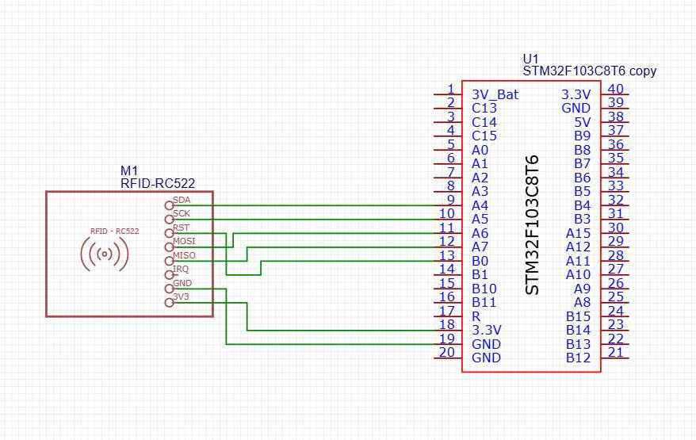

# RFID STM32 Project

## Giới thiệu
Project sử dụng STM32 để giao tiếp với module RFID thông qua việc bật tắt đèn led để báo hiệu khi thẻ được đọc, và kết quả uid đọc được sẽ được đọc thông qua live expression trên STM32CUBEIDE

## Phần cứng sử dụng
- STM32F103C8T6
- Module RFID RC522
- ST-Link
- Nguồn 3.3V

## Phần mềm cần có
- STM32CUBEIDE hoặc Keil C

## Cấu trúc project
```
.
├── main.c
├── rc522.c
├── rc522.h
├── README.md
```

## Sơ đồ kết nối



## Video hướng dẫn cách sử dụng
https://youtu.be/5bsbJDN3KpU?si=DEgDsyG6iGrEGf31

## Demo
https://youtu.be/-p5AeXRZoq8?si=mW_nLC8ogz55dSdS

## Tác giả
**Giang Vĩnh Huy**

Ho Chi Minh City University of Technology and Engineering
